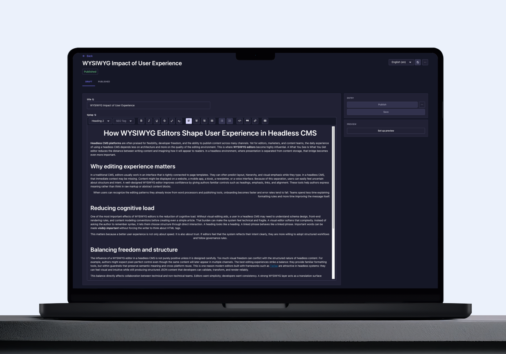

<div align="center">

  <picture >
  <!-- User has no color preference: -->
    <!--  -->
    
  </picture>

  <h1>TipTap Editor Plugin for Strapi V5</h1>
  <p>by<br /></p>
  
  <p>
A drop-in TipTap WYSIWYG editor for Strapi v5. <br> Rich text, tables, images, and more, configured in minutes.
  </p>
  
  
<!-- Badges -->
<p>
  <a href="https://github.com/notum-cz/strapi-plugin-tiptap-editor/graphs/contributors">
    
  </a>
  <a href="">
    
  </a>
  <a href="https://github.com/notum-cz/strapi-plugin-tiptap-editor/issues/">
    
  </a>
  <a href="https://github.com/notum-cz/strapi-plugin-tiptap-editor/blob/main/LICENSE">
    
  </a>
  <a href="https://github.com/notum-cz/strapi-plugin-tiptap-editor/stargazers">
    
  </a>
</p>
   
<h4>
    <a href="https://github.com/notum-cz/strapi-plugin-tiptap-editor/issues/">Report Bug or Request Feature</a>
  
  </h4>
</div>

<br />

<!-- Table of Contents -->

# Table of Contents

- [Table of Contents](#table-of-contents)
  - [About the Project](#about-the-project)
    - [Features](#features)
    - [Screenshots](#screenshots)
    - [Supported Versions](#supported-versions)
  - [Getting Started](#-getting-started)
    - [Installation](#installation)
      - [1. Install the plugin via npm or yarn](#1-install-the-plugin-via-npm-or-yarn)
      - [2. Rebuild Strapi and test the plugin](#2-rebuild-strapi-and-test-the-plugin)
  - [Roadmap](#getting-started)
  - [Community](#-community)
      - [Current maintainer](#current-maintainer)
      - [Contributors](#contributors)
    - [Contributing](#contributing)

<!-- About the Project -->

## About the Project

> [!IMPORTANT]
> This is an **initial release** of the plugin and it doesn't support all features, nor does it support **extensive configuration**. The first thing we will be adding is the ability to configure which features of TipTap you want to use in your Strapi instance.
>
> If you have any suggestions or feature requests, please don't hesitate to open an issue or submit a pull request.

<!-- Features -->

###  Features

- **Rich text editing** powered by [TipTap](https://tiptap.dev/) - a modern, extensible WYSIWYG editor built on ProseMirror
- **Headings** (H1–H6), **bold**, **italic**, **underline**, **strikethrough**
- **Ordered & unordered lists**, task lists
- **Links**, **images**, **tables**
- **Code blocks** with syntax highlighting
- **Blockquotes**, **horizontal rules**
- Full **keyboard shortcut** support
- Seamless integration with Strapi's content management system

<!-- Screenshots -->

### Screenshots

<div align="center"> 
  <picture alt="Strapi Plugin TipTap Editor Interface">
    <!-- <source srcset="https://raw.githubusercontent.com/notum-cz/strapi-plugin-tiptap-editor/master/assets/tiptap-plugin-dark.png" media="(prefers-color-scheme: dark)">
     -->
    <source srcset="assets/tiptap-plugin-dark.png" media="(prefers-color-scheme: dark)">
    
  </picture>
</div>

<!-- Supported Versions -->

### Supported Versions

This plugin is compatible with Strapi `v5.x.x` and has been tested on Strapi `v5.34.0`. We expect it should also work on older version of Strapi V5.

<!-- Getting Started -->

## Getting Started

<!-- Installation -->

### Installation

#### 1. Install the plugin via npm or yarn

```bash
# NPM
npm i @notum-cz/strapi-plugin-tiptap-editor

# Yarn
yarn add @notum-cz/strapi-plugin-tiptap-editor

```

#### 2. Rebuild Strapi and test the plugin

```bash
  yarn build
  yarn start
```

<!-- Roadmap -->

## Roadmap

We're open to feedback and feature requests. Our current roadmap includes:

- [ ] Q2 2026: Add support for configuring which TipTap features to use in Strapi.

<!-- Contributing -->

## 🤝 Community

### Maintained by [Notum Technologies](https://notum.tech)

Built and maintained by [Notum Technologies](https://notum.tech), a Czech-based Strapi Enterprise Partner with a passion for open-source tooling.

This plugin is overseen by Ondřej Janošík and was originally developed by [Ivo Pisařovic](https://github.com/ivopisarovic) and [Dominik Juriga](https://github.com/dominik-juriga).

#### Current maintainer

[Dominik Juriga](https://github.com/dominik-juriga)

#### Contributors

<a href="https://github.com/notum-cz/strapi-plugin-tiptap-editor/graphs/contributors">
  
</a>

### Need help with your Strapi project?

[Notum Technologies](https://notum.tech) builds custom Strapi solutions for enterprise teams. If you'd like to work with us, [book a call](https://calendly.com/notum) or drop us a line at [sales@notum.cz](mailto:sales@notum.cz).

### Contributing

Contributions of all kinds are welcome: code, documentation, bug reports, and feature ideas.
<br> <br> Browse the [open issues](https://github.com/notum-cz/strapi-plugin-tiptap-editor/issues) to find something to work on, or open a new one to start a discussion. Pull requests are always appreciated!