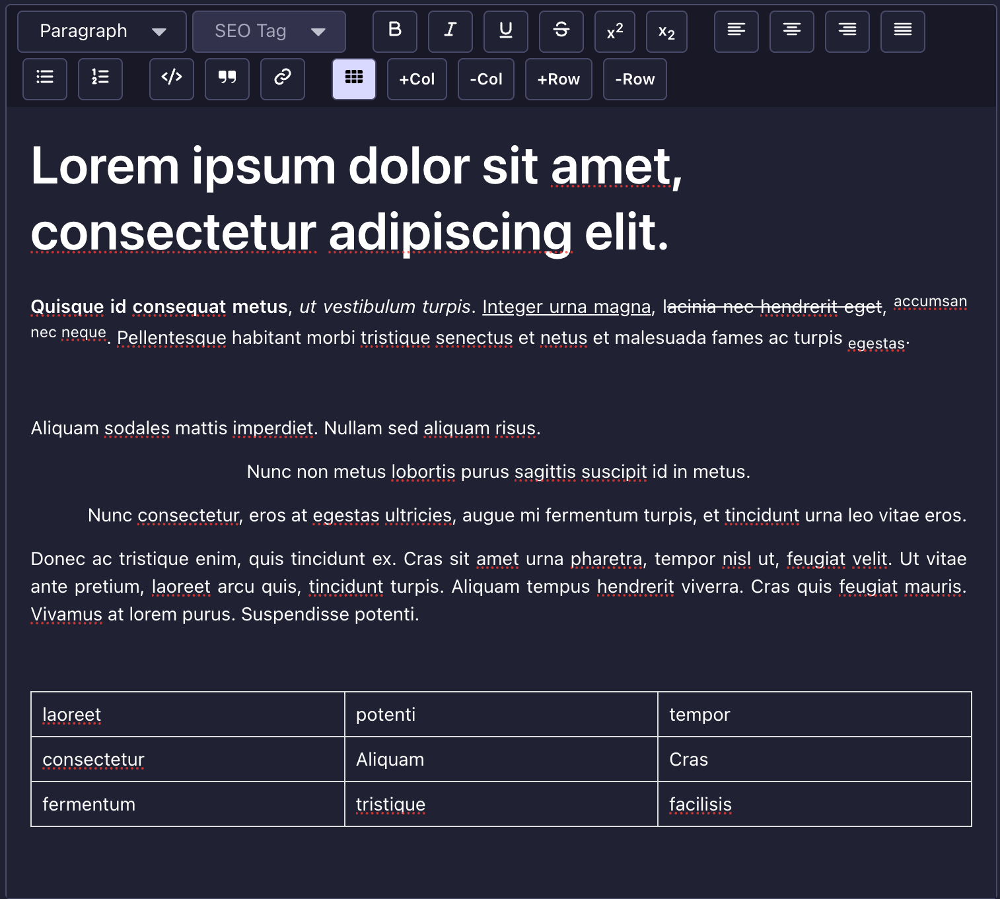

<div align="center">

  <picture >
  <!-- User has no color preference: -->
  
</picture>
  <h1>TipTap Editor Plugin for Strapi V5</h1>

  <p>
Enhance WYSIWYG experience in Strapi V5 with TipTap.
  </p>

<!-- Badges -->
<p>
  <a href="https://github.com/notum-cz/strapi-plugin-tiptap-editor/graphs/contributors">
    
  </a>
  <a href="">
    
  </a>
  <a href="https://github.com/notum-cz/strapi-plugin-tiptap-editor/issues/">
    
  </a>
  <a href="https://github.com/notum-cz/strapi-plugin-tiptap-editor/blob/main/LICENSE">
    
  </a>
</p>

<h4>
    <a href="https://github.com/notum-cz/strapi-plugin-tiptap-editor/issues/">Report Bug or Request Feature</a>

  </h4>
</div>

<br />

<!-- Table of Contents -->

# Table of Contents

- [Table of Contents](#table-of-contents)
  - [About the Project](#about-the-project)
    - [Features](#features)
    - [Screenshots](#screenshots)
    - [Supported Versions](#supported-versions)
  - [Getting Started](#getting-started)
    - [Installation](#installation)
      - [1. Install the plugin via npm or yarn](#1-install-the-plugin-via-npm-or-yarn)
      - [2. Rebuild Strapi and test the plugin](#2-rebuild-strapi-and-test-the-plugin)
  - [Configuration](#configuration)
    - [Defining Presets](#defining-presets)
    - [Assigning a Preset to a Field](#assigning-a-preset-to-a-field)
    - [Multiple Presets](#multiple-presets)
  - [Available Extensions](#available-extensions)
    - [Inline Formatting](#inline-formatting)
    - [Block Elements](#block-elements)
    - [Headings](#headings)
    - [Links](#links)
    - [Tables](#tables)
    - [Text Alignment](#text-alignment)
  - [Configuration Reference](#configuration-reference)
    - [Feature Values](#feature-values)
    - [Full Preset Example](#full-preset-example)
    - [Config Validation](#config-validation)
  - [Community](#community)
    - [This plugin is maintained by Notum Technologies, a Czech-based Strapi Enterprise Partner.](#this-plugin-is-maintained-by-notum-technologies-a-czech-based-strapi-enterprise-partner)
      - [Current maintainer](#current-maintainer)
      - [Contributors](#contributors)
    - [How can Notum help you with your STRAPI project?](#how-can-notum-help-you-with-your-strapi-project)
    - [Contributing](#contributing)

<!-- About the Project -->

## About the Project

<!-- Features -->

### Features

- Rich text editing with TipTap, a modern and extensible WYSIWYG editor built on ProseMirror.
- Seamless integration with Strapi's content management system.
- Preset-based configuration: define named editor presets and assign them per field.
- Only features explicitly enabled in a preset are shown in the toolbar.

<!-- Screenshots -->

### Screenshots

<div align="center">
  
</div>

<!-- Supported Versions -->

### Supported Versions

This plugin is compatible with Strapi `v5.x.x` and has been tested on Strapi `v5.34.0`. We expect it should also work on older version of Strapi V5.

<!-- Getting Started -->

## Getting Started

<!-- Installation -->

### Installation

#### 1. Install the plugin via npm or yarn

```bash
# NPM
npm i @notum-cz/strapi-plugin-tiptap-editor

# Yarn
yarn add @notum-cz/strapi-plugin-tiptap-editor

```

#### 2. Rebuild Strapi and test the plugin

```bash
  yarn build
  yarn start
```

## Configuration

The plugin uses a **preset** system. A preset is a named configuration that defines which editor tools are available. You define presets in your Strapi plugin config file, then assign them to individual fields via the Content-Type Builder.

### Defining Presets

Create or update the plugin configuration file at `config/plugins.ts` (or `config/plugins.js`):

```ts
// config/plugins.ts

export default () => ({
  'tiptap-editor': {
    config: {
      presets: {
        // Preset name -> feature configuration
        minimal: {
          bold: true,
          italic: true,
          link: true,
        },
      },
    },
  },
});
```

Only features explicitly set to `true` (or an options object) will appear in the toolbar. Any feature not listed, or set to `false`, will be hidden.

### Assigning a Preset to a Field

1. In the Strapi admin, open the **Content-Type Builder**.
2. Add or edit a field and choose the **Rich Text (Tiptap)** custom field type.
3. In the **Advanced Settings** tab, select a preset from the **Editor Preset** dropdown.
4. Save the content type.

The editor for that field will now show only the tools defined in the selected preset.

### Multiple Presets

You can define as many presets as you need. Different fields (even within the same content type) can use different presets:

```ts
// config/plugins.ts

export default () => ({
  'tiptap-editor': {
    config: {
      presets: {
        // A minimal preset for short-form content like titles or captions
        minimal: {
          bold: true,
          italic: true,
          underline: true,
        },

        // A standard preset for blog posts and articles
        standard: {
          bold: true,
          italic: true,
          underline: true,
          strike: true,
          heading: true,
          bulletList: true,
          orderedList: true,
          blockquote: true,
          link: true,
        },

        // A full preset with every feature enabled
        full: {
          bold: true,
          italic: true,
          underline: true,
          strike: true,
          code: true,
          codeBlock: true,
          heading: true,
          blockquote: true,
          bulletList: true,
          orderedList: true,
          link: true,
          table: true,
          textAlign: true,
          superscript: true,
          subscript: true,
        },
      },
    },
  },
});
```

## Available Extensions

### Inline Formatting

| Key           | Description        | Toolbar      | Keyboard Shortcut      |
| ------------- | ------------------ | ------------ | ---------------------- |
| `bold`        | Bold text          | **B** button | `Ctrl/Cmd + B`         |
| `italic`      | Italic text        | _I_ button   | `Ctrl/Cmd + I`         |
| `underline`   | Underlined text    | **U** button | `Ctrl/Cmd + U`         |
| `strike`      | Strikethrough text | ~~S~~ button | `Ctrl/Cmd + Shift + S` |
| `code`        | Inline code        | `<>` button  | `Ctrl/Cmd + E`         |
| `superscript` | Superscript text   | x^2 button   | `Ctrl/Cmd + .`         |
| `subscript`   | Subscript text     | x_2 button   | `Ctrl/Cmd + ,`         |

**Usage:** Set to `true` to enable with defaults.

```ts
{
  bold: true,
  italic: true,
  underline: true,
  strike: true,
  code: true,
  superscript: true,
  subscript: true,
}
```

### Block Elements

| Key           | Description        | Toolbar                          |
| ------------- | ------------------ | -------------------------------- |
| `blockquote`  | Block quotes       | Quote button                     |
| `codeBlock`   | Fenced code blocks | (via keyboard or markdown input) |
| `bulletList`  | Unordered lists    | Bullet list button               |
| `orderedList` | Numbered lists     | Numbered list button             |

**Usage:** Set to `true` to enable.

```ts
{
  blockquote: true,
  codeBlock: true,
  bulletList: true,
  orderedList: true,
}
```

### Headings

| Key       | Description            | Toolbar                           |
| --------- | ---------------------- | --------------------------------- |
| `heading` | Heading levels (h1-h6) | Style dropdown + SEO tag dropdown |

The heading extension includes an SEO tag selector that lets content editors set the semantic HTML tag independently from the visual heading level. This allows for proper document outline without being constrained by visual styles.

**Simple usage** — enables all heading levels (h1-h6):

```ts
{
  heading: true,
}
```

**Custom levels** — restrict which heading levels are available:

```ts
{
  // Only allow h1, h2, and h3 in the style dropdown
  heading: {
    levels: [1, 2, 3],
  },
}
```

The `levels` array accepts values from `1` to `6`. The SEO tag dropdown always shows all six levels (h1-h6) regardless of this setting, since the semantic tag is independent of the visual heading level.

### Links

| Key    | Description | Toolbar                   |
| ------ | ----------- | ------------------------- |
| `link` | Hyperlinks  | Link button + link dialog |

Links open a dialog where editors can enter a URL. By default, links do not open on click in the editor (to allow editing).

**Simple usage:**

```ts
{
  link: true,
}
```

**With options:**

```ts
{
  link: {
    openOnClick: true, // Open links on click in the editor (default: false)
    HTMLAttributes: {
      rel: 'noopener noreferrer',
      target: '_blank',
    },
  },
}
```

### Tables

| Key     | Description                    | Toolbar                            |
| ------- | ------------------------------ | ---------------------------------- |
| `table` | Insertable and editable tables | Table button + column/row controls |

Enables table insertion with controls for adding/removing columns and rows. Tables are resizable by default.

```ts
{
  table: true,
}
```

### Text Alignment

| Key         | Description             | Toolbar                              |
| ----------- | ----------------------- | ------------------------------------ |
| `textAlign` | Text alignment controls | Left, Center, Right, Justify buttons |

Enables all four alignment buttons (left, center, right, justify).

```ts
{
  textAlign: true,
}
```

## Configuration Reference

### Feature Values

Each feature key in a preset accepts one of these values:

| Value           | Meaning                                                    |
| --------------- | ---------------------------------------------------------- |
| `true`          | Feature enabled with default options                       |
| `false`         | Feature explicitly disabled                                |
| _(key omitted)_ | Feature disabled (absent keys are treated as disabled)     |
| `{ ... }`       | Feature enabled with custom options (merged with defaults) |

### Full Preset Example

Here is a single preset with every available feature enabled and annotated:

```ts
// config/plugins.ts

export default () => ({
  'tiptap-editor': {
    config: {
      presets: {
        everything: {
          // Inline formatting
          bold: true,
          italic: true,
          underline: true,
          strike: true,
          code: true,
          superscript: true,
          subscript: true,

          // Block elements
          blockquote: true,
          codeBlock: true,
          bulletList: true,
          orderedList: true,

          // Headings — all levels (same as heading: true)
          heading: {
            levels: [1, 2, 3, 4, 5, 6],
          },

          // Links — custom HTML attributes
          link: {
            HTMLAttributes: {
              rel: 'noopener noreferrer',
            },
          },

          // Tables
          table: true,

          // Text alignment (left, center, right, justify)
          textAlign: true,
        },
      },
    },
  },
});
```

### Config Validation

The plugin validates your configuration at startup. If a preset contains an invalid feature key, Strapi will throw an error with a message listing the invalid keys and all allowed keys. This prevents typos from silently disabling features.

```
// This will throw an error at startup:
{
  presets: {
    blog: {
      bold: true,
      boldd: true,  // Typo! Not a valid feature key
    },
  },
}
```

## Community

### This plugin is maintained by [Notum Technologies](https://notum.tech), a Czech-based Strapi Enterprise Partner.

We're a software agency specializing in custom solutions based on Strapi. We're passionate about sharing our expertise with the open-source community.

This plugin is overseen by Ondrej Janosik and it has been originally developed by [Ivo Pisarovic](https://github.com/ivopisarovic) and [Dominik Juriga](https://github.com/dominik-juriga).

#### Current maintainer

[Dominik Juriga](https://github.com/dominik-juriga)

#### Contributors

This plugin has been brought to you thanks to the following contributors:

<a href="https://github.com/notum-cz/strapi-plugin-tiptap-editor/graphs/contributors">
  
</a>

### [How can Notum help you with your STRAPI project?](https://www.notum.tech/notum-and-strapi)

We offer valuable assistance in developing custom STRAPI, web, and mobile apps to fulfill your requirements and goals. With a track record of 100+ projects, our open communication and exceptional project management skills provide us with the necessary tools to get your project across the finish line.

To initiate a discussion about your Strapi project, feel free to reach out to us via email at sales@notum.cz. We're here to assist you!

### Contributing

Contributions are always welcome! Please follow these steps to contribute:

1. Fork the Project
2. Create your Feature Branch (`git checkout -b feature/AmazingFeature`)
3. Commit your Changes (`git commit -m 'Add some AmazingFeature'`)
4. Push to the Branch (`git push origin feature/AmazingFeature`)
5. Open a Pull Request
